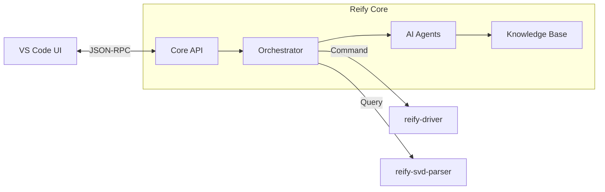

# ReifyFlow Core Engine

[](LICENSE)
[]()
[]()

**ReifyFlow 的核心编排引擎与 AI 智能体管理中心。**

`reify-core` 是整个系统的中枢神经。它接收用户的自然语言指令，通过 LLM 推理生成符合 `reify-protocol` 标准的 JSON 数据，并调度底层的驱动工具完成物理世界的部署。

## 🧠 Core Features

1.  **Intent Understanding**: 将自然语言 ("我要个呼吸灯") 转化为结构化任务书 (`task_spec.json`)。
2.  **Context Management**: 维护当前的硬件状态与软件架构，防止 AI 产生逻辑冲突。
3.  **Tool Orchestration**: 自动调用 `reify-svd-parser` 查询手册，调用 `reify-driver` 生成代码。
4.  **Telemetry Analysis**: 分析回环日志，提供故障诊断建议。

## 🏗️ Architecture



## 🚀 Quick Start

### 1. Installation
```bash
pip install -r requirements.txt
```

### 2. Configuration
Copy `config.example.yaml` to `config.yaml` and set your API Keys.

```yaml
llm:
  provider: "deepseek"
  api_key: "sk-xxxxxx"
```

### 3. Run Server (API Mode)
```bash
python -m api.server
# Server running at http://localhost:8000
```

*Powered by ReifyFlow.*
